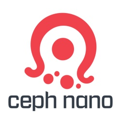

# cn (ceph-nano)



## The project

cn is a little program written in Go that helps you interact with the S3 API by providing a REST S3 compatible gateway. The target audience is developers building their applications on Amazon S3. It is also an exciting tool to showcase Ceph Rados Gateway S3 compatibility.
This is brought to you by the power of Ceph and Containers. Under the hood, cn runs a Ceph container and exposes a [Rados Gateway](http://docs.ceph.com/docs/master/radosgw/). For convenience, cn also comes with a set of commands to work with the S3 gateway. Before you ask "why not using s3cmd instead?", then you will be happy to read that internally cn uses `s3cmd` and act as a wrapper around the most commonly used commands.
Also, keep in mind that the CLI is just for convenience, and the primary use case is you developing your application directly on the S3 API.

## Installation

cn relies on Docker so it must be installed on your machine. If you're not running a Linux workstation you can install [Docker for Mac](https://docs.docker.com/docker-for-mac/).

Once Docker is installed you're ready to start.
Open your terminal and download the cn binary.

macOS:

```bash
curl -L https://github.com/ceph/cn/releases/download/v1.6.1/cn-v1.6.1-b900468-darwin-amd64 -o cn && chmod +x cn
```

Linux:

```bash
curl -L https://github.com/ceph/cn/releases/download/v1.6.1/cn-v1.6.1-b900468-linux-amd64 -o cn && chmod +x cn
```

Test it out

```bash
$ ./cn
Ceph Nano - One step S3 in container with Ceph.

                  *(((((((((((((
                (((((((((((((((((((
              ((((((((*     ,(((((((*
             ((((((             ((((((
            *((((,               ,((((/
            ((((,     ((((((/     *((((
            ((((     (((((((((     ((((
            /(((     (((((((((     ((((
             (((.     (((((((     /(((/
              (((                *((((
              .(((              (((((
         ,(((((((*             /(((
          .(((((  ((( (/  //   (((
                 /(((.  /(((((  /(((((
                        .((((/ (/

Usage:
  cn [command]

Available Commands:
  cluster      Interact with a particular Ceph cluster
  s3           Interact with a particular S3 object server
  image        Interact with cn's container image(s)
  version      Print the version of cn
  kube         Outputs cn kubernetes template (cn kube > kube-cn.yml)
  update-check Print cn current and latest version number
  help         Help about any command

Flags:
  -h, --help   help for cn

Use "cn [command] --help" for more information about a command.
```

## Get started

Start the program with a working directory `/tmp`, the initial start might take a few minutes since we need to download the container image:

```bash
$ ./cn cluster start -d /tmp my-first-cluster
Running ceph-nano...
The container image is not present, pulling it.
This operation can take a few minutes......................................................................................................................................................................................................................................................................................................................................................................................................................................................................................................................................................................

HEALTH_OK is the Ceph status
Your working directory is: /tmp
S3 access key is: 4EO5O2IP4LSGSBC8CUG3
S3 secret key is: Ap8ue6ait0MqgnCIKT7UrCRJGLUoyBhtS2McbNxE
S3 object server address is: http://10.36.116.164:8001
Ceph Nano browser address is: http://10.36.116.164:5001
```

## Your first S3 bucket

Create a bucket with `cn`:

```bash
$ ./cn s3 mb my-first-cluster my-buc
Bucket 's3://my-buc/' created

$ ./cn s3 put my-first-cluster /etc/passwd my-buc
upload: '/tmp/passwd' -> 's3://my-buc/passwd'  [1 of 1]
 5925 of 5925   100% in    1s     4.57 kB/s  done
 ```

## Multi-cluster support

`cn` can manage any number of clusters on your local machine:

```bash
$ ./cn cluster ls
+------+---------+-------------------------------------------------------------------------------------+----------------+--------------------------------+
| NAME | STATUS  | IMAGE                                                                               | IMAGE RELEASE  | IMAGE CREATION TIME            |
+------+---------+-------------------------------------------------------------------------------------+----------------+--------------------------------+
| d    | running | ceph/daemon:latest                                                                  | master-77e3d8d | 2018-04-05T15:01:40.323603472Z |
| b    | running | ceph/daemon@sha256:369867e450ccdea9bcea7f54e97ed8b2cb1a0437fbef658d2d01fce2b8a2c648 | master-5f44af9 | 2018-03-30T21:08:31.117367166Z |
+------+---------+-------------------------------------------------------------------------------------+----------------+--------------------------------+
```

## List Ceph container images available

`cn` can list the available Ceph container image tag available:

```bash
$ ./cn image ls
latest
master-a104cb7-jewel-ubuntu-16.04-x86_64
master-a104cb7-kraken-ubuntu-16.04-x86_64
master-a104cb7-jewel-ubuntu-14.04-x86_64
master-a104cb7-kraken-centos-7-x86_64
master-a104cb7-luminous-centos-7-x86_64
master-a104cb7-luminous-ubuntu-16.04-x86_64
master-a104cb7-jewel-centos-7-x86_64
master-5f44af9-kraken-ubuntu-16.04-x86_64
master-5f44af9-kraken-centos-7-x86_64
```
